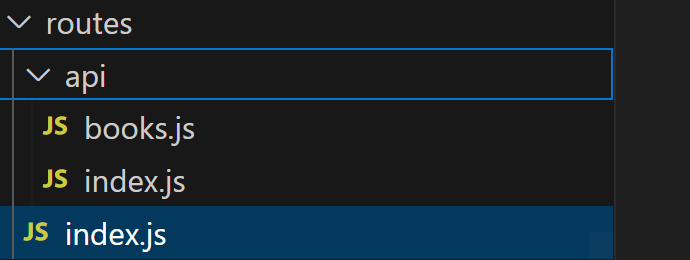

# stepsInDevelopingAnApp

## Here are the steps to create a web application using node

- We need to take discret steps in developing a web application using react as the front-end UI library. Therefore, application development can be divided into Back-End and Front-End Development.

### Part One - Back-End Development.

Here are the back-end development steps.

- Select the DMS (Database Management System for your application):- MySQL, MongoDB, ... etc.
- Create your schema based on the DMS you choosed for your application.
- Create the folder structure for the back-end of the application.
- Create the `server.js` file. This is the entry point for our application. Here is sample `server.js` file.
* The below codes are for MongoDB. The corresponding MySQL part will be provided in the another section.
```javascript
 //Below is the server.js file for MongoDB
const express = require("express");
const mongoose = require("mongoose");
const routes = require("./routes");
const app = express();
const PORT = process.env.PORT || 3001;

// Define middleware here
app.use(express.urlencoded({ extended: true }));
app.use(express.json());
// Serve up static assets (usually on heroku)
if (process.env.NODE_ENV === "production") {
  app.use(express.static("client/build"));
}
// Add routes, both API and view
app.use(routes);

// Connect to the Mongo DB
mongoose.connect(process.env.MONGODB_URI || "mongodb://localhost/reactreadinglist");

// Start the API server
app.listen(PORT, function() {
  console.log(`🌎  ==> API Server now listening on PORT ${PORT}!`);
});
```

- Create the `model` for your application.

* We can have multiple models within our application. All the models can be put in a `models` folder.

```javascript
//Sample book model for a MongoDb
const mongoose = require("mongoose");
const Schema = mongoose.Schema;

const bookSchema = new Schema({
  title: { type: String, required: true },
  author: { type: String, required: true },
  synopsis: String,
  date: { type: Date, default: Date.now },
});

const Book = mongoose.model("Book", bookSchema);

module.exports = Book;

//Here is the index.js file for the model
module.exports = {
  Book: require("./book")
};

```
- Create api routes for your application in the routes folder. There will be one route for each controllers.
Here is the folder structure for your routes.

```javascript
const path = require("path"); //Require the path module to use it in the code.
const router = require("express").Router(); // Require the Router methode of the express module. This is used to append routes in the application.
const apiRoutes = require("./api"); // Require the routes into the file.

// API Routes
router.use("/api", apiRoutes);// Register the routes for your application. Any api call in the form of  "/api" uses the apiRoutes.

// If no API routes are hit, send the React app
router.use(function(req, res) {
  res.sendFile(path.join(__dirname, "../client/build/index.html"));
});
module.exports = router;

```
- Here is the index.js file inside of the api folder.
```javascript
const router = require("express").Router();// Require the Router methode of the express module. This is used to append routes in the application.
const bookRoutes = require("./books");//Require the books route. If more than one route exists in your application, all should be required here.

// Book routes
router.use("/books", bookRoutes); //Any api call in the form of "/api/books" will use the bookRoutes.

module.exports = router;

```
- Here below is the code for the book route.
```javascript
const router = require("express").Router();
const booksController = require("../../controllers/booksController");

// Matches with "/api/books"
router.route("/")
  .get(booksController.findAll)
  .post(booksController.create);

// Matches with "/api/books/:id"
router
  .route("/:id")
  .get(booksController.findById)
  .put(booksController.update)
  .delete(booksController.remove);

module.exports = router;

```
- Create the `controllers` for our application.

* We could have multiple controllers in our application based on the requirement. All the controllers should be stored in the `controllers` folder in our application.
```javascript
const db = require("../models");

// Defining methods for the booksController
module.exports = {
  findAll: function(req, res) {
    db.Book
      .find(req.query)
      .sort({ date: -1 })
      .then(dbModel => res.json(dbModel))
      .catch(err => res.status(422).json(err));
  },
  findById: function(req, res) {
    db.Book
      .findById(req.params.id)
      .then(dbModel => res.json(dbModel))
      .catch(err => res.status(422).json(err));
  },
  create: function(req, res) {
    db.Book
      .create(req.body)
      .then(dbModel => res.json(dbModel))
      .catch(err => res.status(422).json(err));
  },
  update: function(req, res) {
    db.Book
      .findOneAndUpdate({ _id: req.params.id }, req.body)
      .then(dbModel => res.json(dbModel))
      .catch(err => res.status(422).json(err));
  },
  remove: function(req, res) {
    db.Book
      .findById({ _id: req.params.id })
      .then(dbModel => dbModel.remove())
      .then(dbModel => res.json(dbModel))
      .catch(err => res.status(422).json(err));
  }
};

```
- Here is the code for "package.json" of your application.
```json
{
  "name": "[application name]",
  "version": "1.0.0",
  "description": "",
  "main": "server.js",
  "scripts": {
    "start": "if-env NODE_ENV=production && npm run start:prod || npm run start:dev",
    "start:prod": "node server.js",
    "start:dev": "concurrently \"nodemon --ignore 'client/*'\" \"npm run client\"",
    "client": "cd client && npm run start",
    "seed": "node scripts/seedDB.js",
    "install": "cd client && npm install",
    "build": "cd client && npm run build",
    "heroku-postbuild": "npm run build"
  },
  "author": "",
  "license": "ISC",
  "devDependencies": {
    "concurrently": "^4.1.0",
    "nodemon": "^1.18.7"
  },
  "dependencies": {
    "axios": "^0.18.0",
    "express": "^4.16.3",
    "if-env": "^1.0.4",
    "mongoose": "^5.3.16"
  }
}

```
* Below codes are for MySQL DMS.
```javascript
*****************************************************************************
//Server.js - This file is the initial starting point for the Node/Express server.

******************************************************************************
//Dependencies
=============================================================
const express = require("express");
const routes = require("./routes");
//Sets up the Express App
=============================================================
const app = express();
const PORT = process.env.PORT || 8080;

//Requiring our models for syncing
const db = require("./models");

//Sets up the Express app to handle data parsing
app.use(express.urlencoded({ extended: true }));
app.use(express.json());

if (process.env.NODE_ENV === "production") {
  app.use(express.static("client/build"));
}
// Add routes, both API and view
app.use(routes);

//Syncing our sequelize models and then starting our Express app
=============================================================
db.sequelize.sync({ force: true }).then(function() {
  app.listen(PORT, function() {
    console.log("App listening on PORT " + PORT);
  });
});
```
* Below is the index.js file for the models.
```javascript
"use strict";

var fs = require("fs");
var path = require("path");
var Sequelize = require("sequelize");
var basename = path.basename(module.filename);
var env = process.env.NODE_ENV || "development";
var config = require(__dirname + "/../config/config.json")[env];
var db = {};

if (config.use_env_variable) {
  var sequelize = new Sequelize(process.env[config.use_env_variable]);
} else {
  var sequelize = new Sequelize(config.database, config.username, config.password, config);
}

fs
  .readdirSync(__dirname)
  .filter(function(file) {
    return (file.indexOf(".") !== 0) && (file !== basename) && (file.slice(-3) === ".js");
  })
  .forEach(function(file) {
    var model = sequelize["import"](path.join(__dirname, file));
    db[model.name] = model;
  });

Object.keys(db).forEach(function(modelName) {
  if (db[modelName].associate) {
    db[modelName].associate(db);
  }
});

db.sequelize = sequelize;
db.Sequelize = Sequelize;

module.exports = db;

```
* Below is the model code for a simple post.
```javascript
module.exports = function(sequelize, DataTypes) {
  var Book = sequelize.define("Book", {
    title: {
      type: DataTypes.STRING,
      allowNull: false,
      validate: {
        len: [1]
      }
    },
    synopsis: {
      type: DataTypes.TEXT    
      
    },
    author:{
      type: DataTypes.TEXT,
      allowNull: false,
      len: [1]
    },
    date:{
      type: DataTypes.Date,
      allowNull: false
    }
  }); 

  return Book;
};

```
* Below is the code for the controller
```javascript
const db = require("../models");

// Defining methods for the booksController
module.exports = {
  findAll: function(req, res) {
    db.Book
      .findAll({
      where: req.query
    })
      .sort({ date: -1 })
      .then(dbModel => res.json(dbModel))
      .catch(err => res.status(422).json(err));
  },
  findById: function(req, res) {
    db.Book
      .findone(where: {
        id: req.params.id
      })
      .then(dbModel => res.json(dbModel))
      .catch(err => res.status(422).json(err));
  },
  create: function(req, res) {
    db.Book
      .create(req.body)
      .then(dbModel => res.json(dbModel))
      .catch(err => res.status(422).json(err));
  },
  update: function(req, res) {
    db.Book
      .update(
      req.body,
      {
        where: {
          id: req.body.id
        }})
      .then(dbModel => res.json(dbModel))
      .catch(err => res.status(422).json(err));
  },
  remove: function(req, res) {
    db.Book
      destroy({
      where: {
        id: req.params.id
      }
    }).then(dbModel => res.json(dbModel))
      .catch(err => res.status(422).json(err));
  }
};

```
The same folder structure as in the case of MongoDB be used for MySQL as well.

The same routes code could be used with no changes.
- Create api routes for your application in the routes folder. There will be one route for each controllers.
Here is the folder structure for your routes.

```javascript
const path = require("path"); //Require the path module to use it in the code.
const router = require("express").Router(); // Require the Router methode of the express module. This is used to append routes in the application.
const apiRoutes = require("./api"); // Require the routes into the file.

// API Routes
router.use("/api", apiRoutes);// Register the routes for your application. Any api call in the form of  "/api" uses the apiRoutes.

// If no API routes are hit, send the React app
router.use(function(req, res) {
  res.sendFile(path.join(__dirname, "../client/build/index.html"));
});
module.exports = router;

```
- Here is the index.js file inside of the api folder.
```javascript
const router = require("express").Router();// Require the Router methode of the express module. This is used to append routes in the application.
const bookRoutes = require("./books");//Require the books route. If more than one route exists in your application, all should be required here.

// Book routes
router.use("/books", bookRoutes); //Any api call in the form of "/api/books" will use the bookRoutes.

module.exports = router;

```
- Here below is the code for the book route.
```javascript
const router = require("express").Router();
const booksController = require("../../controllers/booksController");

// Matches with "/api/books"
router.route("/")
  .get(booksController.findAll)
  .post(booksController.create);

// Matches with "/api/books/:id"
router
  .route("/:id")
  .get(booksController.findById)
  .put(booksController.update)
  .delete(booksController.remove);

module.exports = router;

```
- Here is the code for "package.json" of your application for the MySQL DMS. The only difference from the MongoDB will be in the dependencies.
```json
{
  "name": "[application name]",
  "version": "1.0.0",
  "description": "",
  "main": "server.js",
  "scripts": {
    "start": "if-env NODE_ENV=production && npm run start:prod || npm run start:dev",
    "start:prod": "node server.js",
    "start:dev": "concurrently \"nodemon --ignore 'client/*'\" \"npm run client\"",
    "client": "cd client && npm run start",
    "seed": "node scripts/seedDB.js",
    "install": "cd client && npm install",
    "build": "cd client && npm run build",
    "heroku-postbuild": "npm run build"
  },
  "author": "",
  "license": "ISC",
  "devDependencies": {
    "concurrently": "^4.1.0",
    "nodemon": "^1.18.7"
  },
  "dependencies": {
    "axios": "^0.18.0",
    "express": "^4.16.3",
    "if-env": "^1.0.4",
    "mysql2": "^1.6.5",
    "sequelize": "^5.8.6"
  }
}
```
* A config file could be added to the application that will provide information about the environment, and holds middleware information for the application as well.
```json
{
  "development": {
    "username": "root",
    "password": null,
    "database": "passport_demo",
    "host": "127.0.0.1",
    "dialect": "mysql"
  },
  "test": {
    "username": "root",
    "password": null,
    "database": "database_test",
    "host": "127.0.0.1",
    "dialect": "mysql"
  },
  "production": {
    "username": "root",
    "password": null,
    "database": "database_production",
    "host": "127.0.0.1",
    "dialect": "mysql"
  }
}

```
### Part Two - Front-End Development - Powered by React.

Here are the front-end development stes for applications whose UI is powered by React.

- Design the wireframes for your application.
- Based on the wireframes for your applications decide the number of pages you are going to create.
- Setup the boiler plate code either by copying from else where or by running `npx create-react-app <appname>` where `<appname>` be replaced by the name of your application. This will setup the initial folder tree for your front-end part of the application.
- Create the `components` for your application.
- Create the `pages` and related `states` for your application.

* The pages could have states of their own.
* State could be managed globally.

### Part Three - Testing.

- Perform end-to-end testing of your application.

### Part Four - Deployment.

- Create cloud database hosting account either for MySQL or MongoDb.
- Create application in Heroku and
- Enable auto deployment feature of GitHub connect with an exiting application in Heroku.
