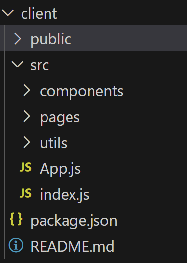

# stepsInDevelopingAnApp

## Here are the steps to create a web application using node

- We need to take discret steps in developing a web application using react as the front-end UI library. Therefore, application development can be divided into Back-End and Front-End Development.

### Part One - Back-End Development.

Here are the back-end development steps.

- Select the DMS (Database Management System for your application):- MySQL, MongoDB, ... etc.
- Create your schema based on the DMS you choosed for your application.
- Create the folder structure for the back-end of the application.
- Create the `server.js` file. This is the entry point for our application. Here is sample `server.js` file.
* The below codes are for MongoDB. The corresponding MySQL part will be provided in the another section.
```javascript
 //Below is the server.js file for MongoDB
const express = require("express");
const mongoose = require("mongoose");
const routes = require("./routes");
const app = express();
const PORT = process.env.PORT || 3001;

// Define middleware here
app.use(express.urlencoded({ extended: true }));
app.use(express.json());
// Serve up static assets (usually on heroku)
if (process.env.NODE_ENV === "production") {
  app.use(express.static("client/build"));
}
// Add routes, both API and view
app.use(routes);

// Connect to the Mongo DB
mongoose.connect(process.env.MONGODB_URI || "mongodb://localhost/reactreadinglist");

// Start the API server
app.listen(PORT, function() {
  console.log(`🌎  ==> API Server now listening on PORT ${PORT}!`);
});
```

- Create the `model` for your application.

* We can have multiple models within our application. All the models can be put in a `models` folder.

```javascript
//Sample book model for a MongoDb
const mongoose = require("mongoose");
const Schema = mongoose.Schema;

const bookSchema = new Schema({
  title: { type: String, required: true },
  author: { type: String, required: true },
  synopsis: String,
  date: { type: Date, default: Date.now },
});

const Book = mongoose.model("Book", bookSchema);

module.exports = Book;

//Here is the index.js file for the model
module.exports = {
  Book: require("./book")
};

```
- Create api routes for your application in the routes folder. There will be one route for each controllers.
Here is the folder structure for your routes.

```javascript
const path = require("path"); //Require the path module to use it in the code.
const router = require("express").Router(); // Require the Router methode of the express module. This is used to append routes in the application.
const apiRoutes = require("./api"); // Require the routes into the file.

// API Routes
router.use("/api", apiRoutes);// Register the routes for your application. Any api call in the form of  "/api" uses the apiRoutes.

// If no API routes are hit, send the React app
router.use(function(req, res) {
  res.sendFile(path.join(__dirname, "../client/build/index.html"));
});
module.exports = router;

```
- Here is the index.js file inside of the api folder.
```javascript
const router = require("express").Router();// Require the Router methode of the express module. This is used to append routes in the application.
const bookRoutes = require("./books");//Require the books route. If more than one route exists in your application, all should be required here.

// Book routes
router.use("/books", bookRoutes); //Any api call in the form of "/api/books" will use the bookRoutes.

module.exports = router;

```
- Here below is the code for the book route.
```javascript
const router = require("express").Router();
const booksController = require("../../controllers/booksController");

// Matches with "/api/books"
router.route("/")
  .get(booksController.findAll)
  .post(booksController.create);

// Matches with "/api/books/:id"
router
  .route("/:id")
  .get(booksController.findById)
  .put(booksController.update)
  .delete(booksController.remove);

module.exports = router;

```
- Create the `controllers` for our application.

* We could have multiple controllers in our application based on the requirement. All the controllers should be stored in the `controllers` folder in our application.
```javascript
const db = require("../models");

// Defining methods for the booksController
module.exports = {
  findAll: function(req, res) {
    db.Book
      .find(req.query)
      .sort({ date: -1 })
      .then(dbModel => res.json(dbModel))
      .catch(err => res.status(422).json(err));
  },
  findById: function(req, res) {
    db.Book
      .findById(req.params.id)
      .then(dbModel => res.json(dbModel))
      .catch(err => res.status(422).json(err));
  },
  create: function(req, res) {
    db.Book
      .create(req.body)
      .then(dbModel => res.json(dbModel))
      .catch(err => res.status(422).json(err));
  },
  update: function(req, res) {
    db.Book
      .findOneAndUpdate({ _id: req.params.id }, req.body)
      .then(dbModel => res.json(dbModel))
      .catch(err => res.status(422).json(err));
  },
  remove: function(req, res) {
    db.Book
      .findById({ _id: req.params.id })
      .then(dbModel => dbModel.remove())
      .then(dbModel => res.json(dbModel))
      .catch(err => res.status(422).json(err));
  }
};

```
- Here is the code for "package.json" of your application.
```json
{
  "name": "[application name]",
  "version": "1.0.0",
  "description": "",
  "main": "server.js",
  "scripts": {
    "start": "if-env NODE_ENV=production && npm run start:prod || npm run start:dev",
    "start:prod": "node server.js",
    "start:dev": "concurrently \"nodemon --ignore 'client/*'\" \"npm run client\"",
    "client": "cd client && npm run start",
    "seed": "node scripts/seedDB.js",
    "install": "cd client && npm install",
    "build": "cd client && npm run build",
    "heroku-postbuild": "npm run build"
  },
  "author": "",
  "license": "ISC",
  "devDependencies": {
    "concurrently": "^4.1.0",
    "nodemon": "^1.18.7"
  },
  "dependencies": {
    "axios": "^0.18.0",
    "express": "^4.16.3",
    "if-env": "^1.0.4",
    "mongoose": "^5.3.16"
  }
}

```
* Below codes are for MySQL DMS.
```javascript
*****************************************************************************
//Server.js - This file is the initial starting point for the Node/Express server.

******************************************************************************
//Dependencies
=============================================================
const express = require("express");
const routes = require("./routes");
//Sets up the Express App
=============================================================
const app = express();
const PORT = process.env.PORT || 8080;

//Requiring our models for syncing
const db = require("./models");

//Sets up the Express app to handle data parsing
app.use(express.urlencoded({ extended: true }));
app.use(express.json());

if (process.env.NODE_ENV === "production") {
  app.use(express.static("client/build"));
}
// Add routes, both API and view
app.use(routes);

//Syncing our sequelize models and then starting our Express app
=============================================================
db.sequelize.sync({ force: true }).then(function() {
  app.listen(PORT, function() {
    console.log("App listening on PORT " + PORT);
  });
});
```
* Below is the index.js file for the models.
```javascript
"use strict";

var fs = require("fs");
var path = require("path");
var Sequelize = require("sequelize");
var basename = path.basename(module.filename);
var env = process.env.NODE_ENV || "development";
var config = require(__dirname + "/../config/config.json")[env];
var db = {};

if (config.use_env_variable) {
  var sequelize = new Sequelize(process.env[config.use_env_variable]);
} else {
  var sequelize = new Sequelize(config.database, config.username, config.password, config);
}

fs
  .readdirSync(__dirname)
  .filter(function(file) {
    return (file.indexOf(".") !== 0) && (file !== basename) && (file.slice(-3) === ".js");
  })
  .forEach(function(file) {
    var model = sequelize["import"](path.join(__dirname, file));
    db[model.name] = model;
  });

Object.keys(db).forEach(function(modelName) {
  if (db[modelName].associate) {
    db[modelName].associate(db);
  }
});

db.sequelize = sequelize;
db.Sequelize = Sequelize;

module.exports = db;

```
* Below is the model code for a simple post.
```javascript
module.exports = function(sequelize, DataTypes) {
  var Book = sequelize.define("Book", {
    title: {
      type: DataTypes.STRING,
      allowNull: false,
      validate: {
        len: [1]
      }
    },
    synopsis: {
      type: DataTypes.TEXT    
      
    },
    author:{
      type: DataTypes.TEXT,
      allowNull: false,
      len: [1]
    },
    date:{
      type: DataTypes.Date,
      allowNull: false
    }
  }); 

  return Book;
};

```
* Below is the code for the controller
```javascript
const db = require("../models");

// Defining methods for the booksController
module.exports = {
  findAll: function(req, res) {
    db.Book
      .findAll({
      where: req.query
    })
      .sort({ date: -1 })
      .then(dbModel => res.json(dbModel))
      .catch(err => res.status(422).json(err));
  },
  findById: function(req, res) {
    db.Book
      .findone(where: {
        id: req.params.id
      })
      .then(dbModel => res.json(dbModel))
      .catch(err => res.status(422).json(err));
  },
  create: function(req, res) {
    db.Book
      .create(req.body)
      .then(dbModel => res.json(dbModel))
      .catch(err => res.status(422).json(err));
  },
  update: function(req, res) {
    db.Book
      .update(
      req.body,
      {
        where: {
          id: req.body.id
        }})
      .then(dbModel => res.json(dbModel))
      .catch(err => res.status(422).json(err));
  },
  remove: function(req, res) {
    db.Book
      destroy({
      where: {
        id: req.params.id
      }
    }).then(dbModel => res.json(dbModel))
      .catch(err => res.status(422).json(err));
  }
};

```
The same folder structure as in the case of MongoDB be used for MySQL as well.

The same routes code could be used with no changes.
- Create api routes for your application in the routes folder. There will be one route for each controllers.
Here is the folder structure for your routes.

```javascript
const path = require("path"); //Require the path module to use it in the code.
const router = require("express").Router(); // Require the Router methode of the express module. This is used to append routes in the application.
const apiRoutes = require("./api"); // Require the routes into the file.

// API Routes
router.use("/api", apiRoutes);// Register the routes for your application. Any api call in the form of  "/api" uses the apiRoutes.

// If no API routes are hit, send the React app
router.use(function(req, res) {
  res.sendFile(path.join(__dirname, "../client/build/index.html"));
});
module.exports = router;

```
- Here is the index.js file inside of the api folder.
```javascript
const router = require("express").Router();// Require the Router methode of the express module. This is used to append routes in the application.
const bookRoutes = require("./books");//Require the books route. If more than one route exists in your application, all should be required here.

// Book routes
router.use("/books", bookRoutes); //Any api call in the form of "/api/books" will use the bookRoutes.

module.exports = router;

```
- Here below is the code for the book route.
```javascript
const router = require("express").Router();
const booksController = require("../../controllers/booksController");

// Matches with "/api/books"
router.route("/")
  .get(booksController.findAll)
  .post(booksController.create);

// Matches with "/api/books/:id"
router
  .route("/:id")
  .get(booksController.findById)
  .put(booksController.update)
  .delete(booksController.remove);

module.exports = router;

```
- Here is the code for "package.json" of your application for the MySQL DMS. The only difference from the MongoDB will be in the dependencies.
```json
{
  "name": "[application name]",
  "version": "1.0.0",
  "description": "",
  "main": "server.js",
  "scripts": {
    "start": "if-env NODE_ENV=production && npm run start:prod || npm run start:dev",
    "start:prod": "node server.js",
    "start:dev": "concurrently \"nodemon --ignore 'client/*'\" \"npm run client\"",
    "client": "cd client && npm run start",
    "seed": "node scripts/seedDB.js",
    "install": "cd client && npm install",
    "build": "cd client && npm run build",
    "heroku-postbuild": "npm run build"
  },
  "author": "",
  "license": "ISC",
  "devDependencies": {
    "concurrently": "^4.1.0",
    "nodemon": "^1.18.7"
  },
  "dependencies": {
    "axios": "^0.18.0",
    "express": "^4.16.3",
    "if-env": "^1.0.4",
    "mysql2": "^1.6.5",
    "sequelize": "^5.8.6"
  }
}
```
* A config file could be added to the application that will provide information about the environment, and holds middleware information for the application as well.
```json
{
  "development": {
    "username": "root",
    "password": null,
    "database": "passport_demo",
    "host": "127.0.0.1",
    "dialect": "mysql"
  },
  "test": {
    "username": "root",
    "password": null,
    "database": "database_test",
    "host": "127.0.0.1",
    "dialect": "mysql"
  },
  "production": {
    "username": "root",
    "password": null,
    "database": "database_production",
    "host": "127.0.0.1",
    "dialect": "mysql"
  }
}

```
### Part Two - Front-End Development - Powered by React.

Here are the front-end development stes for applications whose UI is powered by React.

- Design the wireframes for your application.
- Based on the wireframes for your applications decide the number of pages you are going to create.
- Setup the boiler plate code either by copying from else where or by running `npx create-react-app <appname>` where `<appname>` be replaced by the name of your application. This will setup the initial folder tree for your front-end part of the application.
- Create the `components` for your application.
- Create the `pages` and related `states` for your application.

* The pages could have states of their own.
* State could be managed globally.
- Here is the folder strucute for the react part of the application.

#### React Codes
* App.js
```javascript
import React from "react";
import Books from "./pages/Books";
import Detail from "./pages/Detail";
import NoMatch from "./pages/NoMatch";
import Nav from "./components/Nav";
import { BrowserRouter } from "react-router-dom";

// The app will not render correctly until you setup a Route component.
// Refer to the Basic Example documentation if you need to.
// (https://reacttraining.com/react-router/web/example/basic)
function App() {
  return (
    <BrowserRouter>
    <div>
      <Nav />
      <Books />
    </div>
    </BrowserRouter>
  );
}

export default App;

```
* Book.js (page)
```javascript
import React, { useState, useEffect } from "react";
import DeleteBtn from "../components/DeleteBtn";
import Jumbotron from "../components/Jumbotron";
import API from "../utils/API";
import { Link } from "react-router-dom";
import { Col, Row, Container } from "../components/Grid";
import { List, ListItem } from "../components/List";
import { Input, TextArea, FormBtn } from "../components/Form";

function Books() {
  const [books, setBooks] = useState([])
  const [formObject, setFormObject] = useState({})

  useEffect(() => {
    loadBooks()
  }, [])

  function loadBooks() {
    API.getBooks()
      .then(res => 
        setBooks(res.data)
      )
      .catch(err => console.log(err));
  };

  function deleteBook(id) {
    API.deleteBook(id)
      .then(res => loadBooks())
      .catch(err => console.log(err));
  }

  function handleInputChange(event) {
    const { name, value } = event.target;
    setFormObject({...formObject, [name]: value})
  };

  function handleFormSubmit(event) {
    event.preventDefault();
    if (formObject.title && formObject.author) {
      API.saveBook({
        title: formObject.title,
        author: formObject.author,
        synopsis: formObject.synopsis
      })
        .then(res => loadBooks())
        .catch(err => console.log(err));
    }
  };

    return (
      <Container fluid>
        <Row>
          <Col size="md-6">
            <Jumbotron>
              <h1>What Books Should I Read?</h1>
            </Jumbotron>
            <form>
              <Input
                onChange={handleInputChange}
                name="title"
                placeholder="Title (required)"
              />
              <Input
                onChange={handleInputChange}
                name="author"
                placeholder="Author (required)"
              />
              <TextArea
                onChange={handleInputChange}
                name="synopsis"
                placeholder="Synopsis (Optional)"
              />
              <FormBtn
                disabled={!(formObject.author && formObject.title)}
                onClick={handleFormSubmit}
              >
                Submit Book
              </FormBtn>
            </form>
          </Col>
          <Col size="md-6 sm-12">
            <Jumbotron>
              <h1>Books On My List</h1>
            </Jumbotron>
            {books.length ? (
              <List>
                {books.map(book => (
                  <ListItem key={book._id}>
                    <Link to={"/books/" + book._id}>
                      <strong>
                        {book.title} by {book.author}
                      </strong>
                    </Link>
                    <DeleteBtn onClick={() => deleteBook(book._id)} />
                  </ListItem>
                ))}
              </List>
            ) : (
              <h3>No Results to Display</h3>
            )}
          </Col>
        </Row>
      </Container>
    );
  }


export default Books;

```
* Detail.js(page)
```javascript
import React, { useEffect, useState } from "react";
import { Link, useParams } from "react-router-dom";
import { Col, Row, Container } from "../components/Grid";
import Jumbotron from "../components/Jumbotron";
import API from "../utils/API";

function Detail() {
  const [book, setBook] = useState({})
  
  // Add code to get the book with an _id equal to the id in the route param
  // e.g. http://localhost:3000/books/:id
  // The book id for this route can be accessed using the useParams hook
  // from react-router-dom.
  useEffect(() => {
    API.getBook(/* book id should be passed here */)
      .then(res => setBook(res.data))
      .catch(err => console.log(err));
  }, [])

  return (
      <Container fluid>
        <Row>
          <Col size="md-12">
            <Jumbotron>
              <h1>
                {book.title} by {book.author}
              </h1>
            </Jumbotron>
          </Col>
        </Row>
        <Row>
          <Col size="md-10 md-offset-1">
            <article>
              <h1>Synopsis</h1>
              <p>
                {book.synopsis}
              </p>
            </article>
          </Col>
        </Row>
        <Row>
          <Col size="md-2">
            <Link to="/">← Back to Authors</Link>
          </Col>
        </Row>
      </Container>
    );
  }


export default Detail;

```
* NoMatch.js(page)
```javascript
import React from "react";
import { Col, Row, Container } from "../components/Grid";
import Jumbotron from "../components/Jumbotron";

function NoMatch() {
  return (
    <Container fluid>
      <Row>
        <Col size="md-12">
          <Jumbotron>
            <h1>404 Page Not Found</h1>
            <h1>
              <span role="img" aria-label="Face With Rolling Eyes Emoji">
                🙄
              </span>
            </h1>
          </Jumbotron>
        </Col>
      </Row>
    </Container>
  );
}

export default NoMatch;

```
Here below you will find the different components for the react app.

* Grid (Component)
```javascript
import React from "react";

// Exporting the Container, Row, and Col components from this file

// This Container component allows us to use a bootstrap container without worrying about class names
export function Container({ fluid, children }) {
  return <div className={`container${fluid ? "-fluid" : ""}`}>{children}</div>;
}

// This Row component lets us use a bootstrap row without having to think about class names
export function Row({ fluid, children }) {
  return <div className={`row${fluid ? "-fluid" : ""}`}>{children}</div>;
}

// This Col component lets us size bootstrap columns with less syntax
// e.g. <Col size="md-12"> instead of <div className="col-md-12">
export function Col({ size, children }) {
  return (
    <div
      className={size
        .split(" ")
        .map(size => "col-" + size)
        .join(" ")}
    >
      {children}
    </div>
  );
}

```
* Jumbotron (Component)
```javascript
import React from "react";

function Jumbotron({ children }) {
  return (
    <div
      style={{ height: 300, clear: "both", paddingTop: 120, textAlign: "center" }}
      className="jumbotron"
    >
      {children}
    </div>
  );
}

export default Jumbotron;

```
* List.js(Component)
```javascript
import React from "react";
import "./style.css";

// This file exports both the List and ListItem components

export function List({ children }) {
  return (
    <div className="list-overflow-container">
      <ul className="list-group">{children}</ul>
    </div>
  );
}

export function ListItem({ children }) {
  return <li className="list-group-item">{children}</li>;
}

```
```css
.list-overflow-container {
  max-height: 545px;
  border: 1px #DDDDDD solid;
  border-radius: 4px;
  overflow-y: scroll;
  overflow-x: hidden;
}

.list-overflow-container ul {
  margin: 0;
}

.list-overflow-container li {
  border-radius: 0px;
  border-left: none;
  border-right: none;
}

.list-overflow-container li * {
  cursor: pointer;
}

.list-overflow-container li a {
  color: #2A878C;
}

.list-overflow-container li:first-child {
  border-top: none;
}

.list-overflow-container li:last-child {
  border-bottom: none;
}

```
* Nav.js(Component)
```javascript
import React from "react";

function Nav() {
  return (
    <nav className="navbar navbar-expand-lg navbar-dark bg-primary">
      <a className="navbar-brand" href="/">
        React Reading List
      </a>
    </nav>
  );
}

export default Nav;

```
* API.js (Util)
```javascript
import axios from "axios";

export default {
  // Gets all books
  getBooks: function() {
    return axios.get("/api/books");
  },
  // Gets the book with the given id
  getBook: function(id) {
    return axios.get("/api/books/" + id);
  },
  // Deletes the book with the given id
  deleteBook: function(id) {
    return axios.delete("/api/books/" + id);
  },
  // Saves a book to the database
  saveBook: function(bookData) {
    return axios.post("/api/books", bookData);
  }
};

```
* Package.json(packe file for the react part)
```json
{
  "name": "[App Name]",
  "version": "0.1.0",
  "private": true,
  "proxy": "http://localhost:3001/",
  "dependencies": {
    "axios": "^0.18.0",
    "react": "^16.13.1",
    "react-dom": "^16.13.1",
    "react-router-dom": "^5.1.2",
    "react-scripts": "3.4.3"
  },
  "scripts": {
    "start": "react-scripts start",
    "build": "react-scripts build",
    "test": "react-scripts test --env=jsdom",
    "eject": "react-scripts eject"
  },
  "browserslist": [
    ">0.2%",
    "not dead",
    "not ie <= 11",
    "not op_mini all"
  ]
}

```

* SeedDB.js (the seed file which is in the scripts folder)
```javascript
const mongoose = require("mongoose");
const db = require("../models");

// This file empties the Books collection and inserts the books below

mongoose.connect(
  process.env.MONGODB_URI ||
  "mongodb://localhost/reactreadinglist"
);

const bookSeed = [
  {
    title: "The Dead Zone",
    author: "Stephen King",
    synopsis:
      "A number-one national best seller about a man who wakes up from a five-year coma able to see people's futures and the terrible fate awaiting mankind in The Dead Zone - a \"compulsive page-turner\" (The Atlanta Journal-Constitution). Johnny Smith awakens from a five-year coma after his car accident and discovers that he can see people's futures and pasts when he touches them. Many consider his talent a gift; Johnny feels cursed. His fiancée married another man during his coma, and people clamor for him to solve their problems. When Johnny has a disturbing vision after he shakes the hand of an ambitious and amoral politician, he must decide if he should take drastic action to change the future. The Dead Zone is a \"faultlessly paced...continuously engrossing\" (Los Angeles Times) novel of second sight.",
    date: new Date(Date.now())
  },
  {
    title: "Lord of the Flies",
    author: "William Golding",
    synopsis:
      "The tale of a party of shipwrecked schoolboys, marooned on a coral island, who at first enjoy the freedom of the situation but soon divide into fearsome gangs which turn the paradise island into a nightmare of panic and death.",
    date: new Date(Date.now())
  },
  {
    title: "The Catcher in the Rye",
    author: "J.D. Salinger",
    synopsis:
      "The Catcher in the Rye is a 1951 novel by J. D. Salinger. A controversial novel originally published for adults, it has since become popular with adolescent readers for its themes of teenage angst and alienation. It has been translated into almost all of the world's major languages. Around 1 million copies are sold each year with total sales of more than 65 million books. The novel's protagonist Holden Caulfield has become an icon for teenage rebellion. The novel also deals with complex issues of innocence, identity, belonging, loss, and connection.",
    date: new Date(Date.now())
  },
  {
    title: "The Punch Escrow",
    author: "Tal M. Klein",
    synopsis:
      "It's the year 2147. Advancements in nanotechnology have enabled us to control aging. We’ve genetically engineered mosquitoes to feast on carbon fumes instead of blood, ending air pollution. And teleportation has become the ideal mode of transportation, offered exclusively by International Transport―the world’s most powerful corporation, in a world controlled by corporations. Joel Byram spends his days training artificial-intelligence engines to act more human and trying to salvage his deteriorating marriage. He’s pretty much an everyday twenty-second century guy with everyday problems―until he’s accidentally duplicated while teleporting. Now Joel must outsmart the shadowy organization that controls teleportation, outrun the religious sect out to destroy it, and find a way to get back to the woman he loves in a world that now has two of him.",
    date: new Date(Date.now())
  },
  {
    title: "Harry Potter and the Sorcerer's Stone",
    author: "J.K. Rowling",
    synopsis:
      "Harry Potter has no idea how famous he is. That's because he's being raised by his miserable aunt and uncle who are terrified Harry will learn that he's really a wizard, just as his parents were. But everything changes when Harry is summoned to attend an infamous school for wizards, and he begins to discover some clues about his illustrious birthright. From the surprising way he is greeted by a lovable giant, to the unique curriculum and colorful faculty at his unusual school, Harry finds himself drawn deep inside a mystical world he never knew existed and closer to his own noble destiny.",
    date: new Date(Date.now())
  },
  {
    title: "Coraline",
    author: "Neil Gaiman",
    synopsis:
      "When Coraline steps through a door to find another house strangely similar to her own (only better), things seem marvelous. But there's another mother there, and another father, and they want her to stay and be their little girl. They want to change her and never let her go. Coraline will have to fight with all her wit and courage if she is to save herself and return to her ordinary life.",
    date: new Date(Date.now())
  },
  {
    title: "Code: The Hidden Language of Computer Hardware and Software",
    author: "Charles Petzold",
    synopsis:
      "What do flashlights, the British invasion, black cats, and seesaws have to do with computers? In CODE, they show us the ingenious ways we manipulate language and invent new means of communicating with each other. And through CODE, we see how this ingenuity and our very human compulsion to communicate have driven the technological innovations of the past two centuries. Using everyday objects and familiar language systems such as Braille and Morse code, author Charles Petzold weaves an illuminating narrative for anyone who’s ever wondered about the secret inner life of computers and other smart machines. It’s a cleverly illustrated and eminently comprehensible story—and along the way, you’ll discover you’ve gained a real context for understanding today’s world of PCs, digital media, and the Internet. No matter what your level of technical savvy, CODE will charm you—and perhaps even awaken the technophile within.",
    date: new Date(Date.now())
  },
  {
    title: "The Everything Store: Jeff Bezos and the Age of Amazon",
    author: "Brad Stone",
    synopsis:
      "The definitive story of Amazon.com, one of the most successful companies in the world, and of its driven, brilliant founder, Jeff Bezos. Amazon.com started off delivering books through the mail. But its visionary founder, Jeff Bezos, wasn't content with being a bookseller. He wanted Amazon to become the everything store, offering limitless selection and seductive convenience at disruptively low prices. To do so, he developed a corporate culture of relentless ambition and secrecy that's never been cracked. Until now. Brad Stone enjoyed unprecedented access to current and former Amazon employees and Bezos family members, giving listeners the first in-depth, fly-on-the-wall account of life at Amazon. Compared to tech's other elite innovators - Jobs, Gates, Zuckerberg - Bezos is a private man. But he stands out for his restless pursuit of new markets, leading Amazon into risky new ventures like the Kindle and cloud computing, and transforming retail in the same way Henry Ford revolutionized manufacturing. The Everything Store will be the revealing, definitive biography of the company that placed one of the first and largest bets on the Internet and forever changed the way we shop and read.",
    date: new Date(Date.now())
  },
  {
    title: "Total Recall: My Unbelievably True Life Story",
    author: "Arnold Schwarzenegger",
    synopsis:
      "In his signature larger-than-life style, Arnold Schwarzenegger’s Total Recall is a revealing self-portrait of his illustrious, controversial, and truly unique life. The greatest immigrant success story of our time. His story is unique, and uniquely entertaining, and he tells it brilliantly in these pages. He was born in a year of famine, in a small Austrian town, the son of an austere police chief. He dreamed of moving to America to become a bodybuilding champion and a movie star. By the age of twenty-one, he was living in Los Angeles and had been crowned Mr. Universe. Within five years, he had learned English and become the greatest bodybuilder in the world. Within ten years, he had earned his college degree and was a millionaire from his business enterprises in real estate, landscaping, and bodybuilding. He was also the winner of a Golden Globe Award for his debut as a dramatic actor in Stay Hungry. Within twenty years, he was the world’s biggest movie star, the husband of Maria Shriver, and an emerging Republican leader who was part of the Kennedy family. Thirty-six years after coming to America, the man once known by fellow body­builders as the Austrian Oak was elected governor of California, the seventh largest economy in the world. He led the state through a budget crisis, natural disasters, and political turmoil, working across party lines for a better environment, election reforms, and bipartisan solutions. With Maria Shriver, he raised four fantastic children. In the wake of a scandal he brought upon himself, he tried to keep his family together. Until now, he has never told the full story of his life, in his own voice. Here is Arnold, with total recall.",
    date: new Date(Date.now())
  },
  {
    title: "Elon Musk: Tesla, SpaceX, and the Quest for a Fantastic Future",
    author: "Ashlee Vance",
    synopsis:
      "In the spirit of Steve Jobs and Moneyball, Elon Musk is both an illuminating and authorized look at the extraordinary life of one of Silicon Valley's most exciting, unpredictable, and ambitious entrepreneurs - a real-life Tony Stark - and a fascinating exploration of the renewal of American invention and its new makers. Elon Musk spotlights the technology and vision of Elon Musk, the renowned entrepreneur and innovator behind SpaceX, Tesla, and SolarCity, who sold one of his Internet companies, PayPal, for $1.5 billion. Ashlee Vance captures the full spectacle and arc of the genius' life and work, from his tumultuous upbringing in South Africa and flight to the United States to his dramatic technical innovations and entrepreneurial pursuits. Vance uses Musk's story to explore one of the pressing questions of our age: Can the nation of inventors and creators who led the modern world for a century still compete in an age of fierce global competition? He argues that Musk - one of the most unusual and striking figures in American business history - is a contemporary, visionary amalgam of legendary inventors and industrialists, including Thomas Edison, Henry Ford, Howard Hughes,and Steve Jobs. More than any other entrepreneur today, Musk has dedicated his energies and his own vast fortune to inventing a future that is as rich and far reaching as the visionaries of the golden age of science-fiction fantasy.",
    date: new Date(Date.now())
  },
  {
    title: "Steve Jobs",
    author: "Walter Isaacson",
    synopsis:
      "Based on more than 40 interviews with Jobs conducted over two years - as well as interviews with more than a hundred family members, friends, adversaries, competitors, and colleagues - Walter Isaacson has written a riveting story of the roller-coaster life and searingly intense personality of a creative entrepreneur whose passion for perfection and ferocious drive revolutionized six industries: personal computers, animated movies, music, phones, tablet computing, and digital publishing. At a time when America is seeking ways to sustain its innovative edge, and when societies around the world are trying to build digital-age economies, Jobs stands as the ultimate icon of inventiveness and applied imagination. He knew that the best way to create value in the 21st century was to connect creativity with technology. He built a company where leaps of the imagination were combined with remarkable feats of engineering. Although Jobs cooperated with this book, he asked for no control over what was written. He put nothing off-limits. He encouraged the people he knew to speak honestly. And Jobs speaks candidly, sometimes brutally so, about the people he worked with and competed against. His friends, foes,and colleagues provide an unvarnished view of the passions, perfectionism, obsessions, artistry, devilry, and compulsion for control that shaped his approach to business and the innovative products that resulted. Driven by demons, Jobs could drive those around him to fury and despair. But his personality and products were interrelated, just as Apple's hardware and software tended to be, as if part of an integrated system. His tale is instructive and cautionary, filled with lessons about innovation, character, leadership, and values.",
    date: new Date(Date.now())
  },
  {
    title: "Astrophysics for People in a Hurry",
    author: "Neil deGrasse Tyson",
    synopsis:
      "What is the nature of space and time? How do we fit within the universe? How does the universe fit within us? There's no better guide through these mind-expanding questions than acclaimed astrophysicist and best-selling author Neil deGrasse Tyson. But today, few of us have time to contemplate the cosmos. So Tyson brings the universe down to Earth succinctly and clearly, with sparkling wit, in digestible chapters consumable anytime and anywhere in your busy day. While waiting for your morning coffee to brew, or while waiting for the bus, the train, or the plane to arrive, Astrophysics for People in a Hurry will reveal just what you need to be fluent and ready for the next cosmic headlines: from the big bang to black holes, from quarks to quantum mechanics, and from the search for planets to the search for life in the universe.",
    date: new Date(Date.now())
  },
  {
    title: "1984",
    author: "George Orwell",
    synopsis:
      "Winston Smith toes the Party line, rewriting history to satisfy the demands of the Ministry of Truth. With each lie he writes, Winston grows to hate the Party that seeks power for its own sake and persecutes those who dare to commit thoughtcrimes. But as he starts to think for himself, Winston can’t escape the fact that Big Brother is always watching... A startling and haunting vision of the world, 1984 is so powerful that it is completely convincing from start to finish. No one can deny the influence of this novel, its hold on the imaginations of multiple generations of readers, or the resiliency of its admonitions—a legacy that seems only to grow with the passage of time.",
    date: new Date(Date.now())
  },
  {
    title: "Frankenstein",
    author: "Mary Shelley",
    synopsis:
      "Few creatures of horror have seized readers' imaginations and held them for so long as the anguished monster of Mary Shelley's Frankenstein. The story of Victor Frankenstein's terrible creation and the havoc it caused has enthralled generations of readers and inspired countless writers of horror and suspense. Considering the novel's enduring success, it is remarkable that it began merely as a whim of Lord Byron's. \"We will each write a story,\" Byron announced to his next-door neighbors, Mary Wollstonecraft Godwin and her lover Percy Bysshe Shelley. The friends were summering on the shores of Lake Geneva in Switzerland in 1816, Shelley still unknown as a poet and Byron writing the third canto of Childe Harold. When continued rains kept them confined indoors, all agreed to Byron's proposal. The illustrious poets failed to complete their ghost stories, but Mary Shelley rose supremely to the challenge. With Frankenstein, she succeeded admirably in the task she set for herself: to create a story that, in her own words, \"would speak to the mysterious fears of our nature and awaken thrilling horror -- one to make the reader dread to look round, to curdle the blood, and quicken the beatings of the heart.\"",
    date: new Date(Date.now())
  },
  {
    title: "The Great Gatsby",
    author: "F. Scott Fitzgerald",
    synopsis:
      "The authentic edition from Fitzgerald's original publisher. This edition approved by the Holden-Crowther Literary Organisation. The Great Gatsby, F. Scott Fitzgerald's third book, stands as the supreme achievement of his career. This exemplary novel of the Jazz Age has been acclaimed by generations of readers. The story of the fabulously wealthy Jay Gatsby and his love for the beautiful Daisy Buchanan, of lavish parties on Long Island at a time when The New York Times noted \"gin was the national drink and sex the national obsession,\" it is an exquisitely crafted tale of America in the 1920s. The Great Gatsby is one of the great classics of twentieth-century literature.",
    date: new Date(Date.now())
  },
  {
    title: "Born a Crime: Stories from a South African Childhood",
    author: "Trevor Noah",
    synopsis:
      "Trevor Noah, one of the comedy world's fastest-rising stars and host of The Daily Show, tells his wild coming-of-age story during the twilight of apartheid in South Africa and the tumultuous days of freedom that followed. In this Audible Studios production, Noah provides something deeper than traditional memoirists: powerfully funny observations about how farcical political and social systems play out in our lives. \"Nelson Mandela once said, 'If you talk to a man in a language he understands, that goes to his head. If you talk to him in his language, that goes to his heart.' He was so right. When you make the effort to speak someone elses language, even if it's just basic phrases here and there, you are saying to them, 'I understand that you have a culture and identity that exists beyond me. I see you as a human being.'\" (Trevor Noah)\nAttuned to the power of language at a young age - as a means of acceptance and influence in a country divided, then subdivided, into groups at odds with one another - Noah's raw, personal journey becomes something extraordinary in audio: a true testament to the power of storytelling. With brutal honesty and piercing wit, he forgoes an ordinary reading and, instead, delivers something more intimate, sharing his story with the openness and candor of a close friend. His chameleon-like ability to mimic accents and dialects, to shift effortlessly between languages including English, Xhosa, and Zulu, and to embody characters throughout his childhood - his mother, his gran, his schoolmates, first crushes and infatuations - brings each memory to life in vivid detail. Hearing him directly, you're reminded of the gift inherent in telling one's story and having it heard; of connecting with another, and seeing them as a human being.\nThe stories Noah tells are by turns hilarious, bizarre, tender, dark, and poignant - subsisting on caterpillars during months of extreme poverty, making comically pitiful attempts at teenage romance in a color-obsessed world, thrown into jail as the hapless fall guy for a crime he didn't commit, thrown by his mother from a speeding car driven by murderous gangsters, and more.",
    date: new Date(Date.now())
  }
];

db.Book
  .remove({})
  .then(() => db.Book.collection.insertMany(bookSeed))
  .then(data => {
    console.log(data.result.n + " records inserted!");
    process.exit(0);
  })
  .catch(err => {
    console.error(err);
    process.exit(1);
  });

```
### Part Three - Testing.

- Perform end-to-end testing of your application.

### Part Four - Deployment.

- Create cloud database hosting account either for MySQL or MongoDb.
- Create application in Heroku and
- Enable auto deployment feature of GitHub connect with an exiting application in Heroku.
